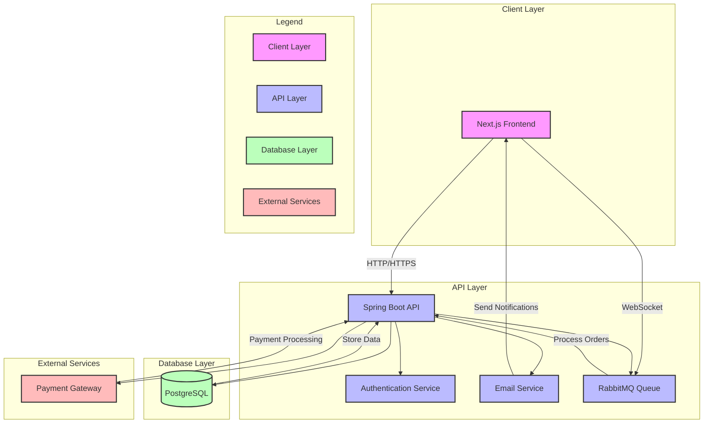

# Online Marketplace Platform

A full-stack online marketplace platform built with Spring Boot and Next.js, featuring user authentication, product management, order processing, and more.

## ⚠️ IMPORTANT: Default Admin Credentials ⚠️

> **Admin Account (Automatically Created on App First Start)**
> - **Email:** admin@example.com
> - **Password:** adminpass
>
> Use these credentials to access the admin dashboard and set up the initial system configuration.

## ⚠️ IMPORTANT: User Registration and Order Workflow ⚠️

> **Email Verification Required**
> - After registration, you MUST verify your email
> - Check your verification email at http://localhost:8025/#
> - Click the verification link in the email
> - Without email verification, you cannot log in to the system
>
> **Order Completion Process**
> - Orders start in "PENDING" status
> - Move to "PROCESSING" when being handled
> - Can only be marked as "COMPLETED" by:
>   - The seller who owns the store
>   - An admin user
> - Shoppers will receive email notifications at each status change
>
> **Product Stock Management**
> - Products are automatically marked as:
>   - "IN_STOCK" when quantity > 0
>   - "OUT_OF_STOCK" when quantity = 0
> - When registering products, sellers/admins must specify:
>   - Current price
>   - Original price (for discount calculations)
>   - Available quantity in stock
> - Purchase restrictions:
>   - Cannot purchase products marked as "OUT_OF_STOCK"
>   - Cannot purchase more items than available in stock
>   - System will show warning if cart quantity exceeds available stock
>   - Payment will be blocked if stock becomes unavailable during checkout
>
> **Seller Application Process**
> - Users can apply to become sellers using their registered email
> - Admin approval required:
>   - Only admins can approve or deny seller applications
>   - Admin must log in to review and process applications
> - After approval:
>   - Seller gains access to seller dashboard
>   - Can create and manage their store
>   - Can handle orders and product management
> - Account restrictions:
>   - One seller account per user
>   - Can update existing seller account
>   - Cannot create multiple seller accounts

## License

This project is licensed under the MIT License - see the LICENSE file for details. 

## System Design Diagram

> **Note:** The system design diagram below is created using Mermaid. To view it properly:
> - On GitHub: The diagram will render automatically
> - In VS Code: Install the "Markdown Preview Mermaid Support" extension
> - Online: Copy the code and paste it into [Mermaid Live Editor](https://mermaid.live)
> - In other editors: Use a Mermaid-compatible markdown viewer



## Prerequisites

- Docker and Docker Compose
- Node.js 18+ (for local development)
- Java 17+ (for local development)
- Maven (for local development)

## Docker Setup

The application uses Docker Compose to orchestrate multiple services. The following services are included:

### Services Overview

1. **PostgreSQL Database**
   - Port: 5432
   - Database: marketplace
   - Username: postgres
   - Password: postgres
   - Persistent volume for data storage

2. **RabbitMQ**
   - AMQP Port: 5672
   - Management UI: http://localhost:15672
   - Default credentials: guest/guest
   - Used for asynchronous order processing

3. **MailHog**
   - SMTP Server: localhost:1025
   - Web UI: http://localhost:8025
   - Used for email testing and development

4. **Spring Boot Backend**
   - Port: 8082
   - Swagger UI: http://localhost:8082/swagger-ui.html
   - Connected to all required services

5. **Next.js Frontend**
   - Port: 3000
   - Connected to backend API

### Running with Docker

1. Ensure Docker and Docker Compose are installed on your system

2. Clone the repository and navigate to the project root:
```bash
git clone <repository-url>
cd marketplace-platform
```

3. Start all services:
```bash
docker-compose up -d
```

4. Access the services:
   - Frontend: http://localhost:3000
   - Backend API: http://localhost:8082
   - Swagger Documentation: http://localhost:8082/swagger-ui.html
   - RabbitMQ Management: http://localhost:15672
   - MailHog (Email Testing): http://localhost:8025

5. Stop all services:
```bash
docker-compose down
```

6. View logs:
```bash
# All services
docker-compose logs -f

# Specific service
docker-compose logs -f backend
docker-compose logs -f frontend
```

### Environment Configuration

The Docker Compose setup includes all necessary environment variables for the services to communicate with each other. Key configurations:

- Database connection is automatically configured
- RabbitMQ connection is set up for message queuing
- MailHog is configured for email testing
- Frontend is configured to connect to the backend API

### Persistent Data

The setup includes persistent volumes for:
- PostgreSQL data
- RabbitMQ data

This ensures your data persists between container restarts.

### Accessing Services

After starting the application with Docker Compose, you can access all services through your web browser or development tools:

#### Email Testing (MailHog)
- Web Interface: http://localhost:8025
- SMTP Server: localhost:1025
- Use this to test all email functionality:
  - User registration verification
  - Seller approval notifications
  - Order status updates

#### Message Queue (RabbitMQ)
- Management Interface: http://localhost:15672
- Default credentials: guest/guest
- Monitor message queues and processing:
  - Order processing queues
  - Email notification queues
  - System event queues

#### Database (PostgreSQL)
- Host: localhost
- Port: 5432
- Database: marketplace
- Username: postgres
- Password: postgres
- Connect using your preferred database tool (e.g., pgAdmin, DBeaver)

#### Backend API
- API Base URL: http://localhost:8082
- Swagger Documentation: http://localhost:8082/swagger-ui.html
- Test all API endpoints through Swagger UI
- View API documentation and schemas

#### Frontend Application
- Web Interface: http://localhost:3000
- Access the marketplace platform
- Test all user roles:
  - Admin dashboard
  - Seller dashboard
  - Shopper interface

> **Important Note on Frontend Routing:**
> - The landing page and main entry point is always `/` (root)
> - The system has a known routing behavior where it might attempt to render `/login`
> - A workaround is implemented to automatically redirect `/login` to `/`
> - This is a temporary solution and will be fixed in future updates
> - Always use `/` as the main entry point for the application

### Service Management

#### View Service Status
```bash
# Check status of all services
docker-compose ps

# View logs of all services
docker-compose logs -f

# View logs of specific service
docker-compose logs -f backend
docker-compose logs -f frontend
docker-compose logs -f mailhog
```

#### Common Operations
```bash
# Restart a specific service
docker-compose restart backend

# Stop all services
docker-compose down

# Start all services
docker-compose up -d

# Rebuild and start services
docker-compose up -d --build
```

#### Troubleshooting
1. If a service is not accessible:
   - Check if the container is running: `docker-compose ps`
   - View service logs: `docker-compose logs -f [service-name]`
   - Ensure ports are not in use by other applications

2. If database connection fails:
   - Check PostgreSQL logs: `docker-compose logs -f postgres`
   - Verify database credentials in application.properties

3. If email testing doesn't work:
   - Access MailHog UI: http://localhost:8025
   - Check email service logs: `docker-compose logs -f mailhog`

4. If RabbitMQ is not working:
   - Access management UI: http://localhost:15672
   - Check RabbitMQ logs: `docker-compose logs -f rabbitmq`

## Local Development Setup

### Backend Setup

1. Navigate to the backend directory:
```bash
cd marketplace-api
```

2. Install dependencies:
```bash
mvn install
```

3. Run the application:
```bash
mvn spring-boot:run
```

### Frontend Setup

1. Navigate to the frontend directory:
```bash
cd marketplace-front-end
```

2. Install dependencies:
```bash
npm install
```

3. Run the development server:
```bash
npm run dev
```

## API Documentation

The API documentation is available through Swagger UI at http://localhost:8080/swagger-ui.html when running the application.

### Key Endpoints

#### Authentication
- POST /api/auth/register - Register new user
- POST /api/auth/login - User login
- POST /api/auth/verify-email - Email verification

#### Categories (Admin Only)
- POST /api/admin/categories - Create category
- GET /api/admin/categories - List all categories
- PUT /api/admin/categories/{id} - Update category
- DELETE /api/admin/categories/{id} - Delete category

#### Users
- GET /api/users/profile - Get user profile
- PUT /api/users/profile - Update user profile

#### Stores
- POST /api/stores - Create store (Seller only)
- GET /api/stores - List stores
- GET /api/stores/{id} - Get store details

#### Products
- POST /api/products - Create product (Seller only)
- GET /api/products - List products
- GET /api/products/{id} - Get product details
- PUT /api/products/{id} - Update product (Seller only)
- DELETE /api/products/{id} - Delete product (Seller only)

#### Orders
- POST /api/orders - Create order
- GET /api/orders - List user orders
- GET /api/orders/{id} - Get order details
- PUT /api/orders/{id}/status - Update order status (Admin/Seller only)

#### Admin
- GET /api/admin/users - List all users
- POST /api/admin/sellers/approve - Approve seller
- PUT /api/admin/products/{id}/feature - Feature product

## Entity Relationships

### Users
- One-to-One with Store (for Sellers)
- One-to-Many with Orders (for Shoppers)
- One-to-Many with Reviews

### Stores
- One-to-One with User (Seller)
- One-to-Many with Products

### Products
- Many-to-One with Store
- Many-to-One with Category
- One-to-Many with Reviews
- One-to-Many with OrderItems

### Orders
- Many-to-One with User (Shopper)
- One-to-Many with OrderItems

### Categories
- One-to-Many with Products

## Running Tests

### Backend Tests
```bash
cd marketplace-api
mvn test
```

### Frontend Tests
```bash
cd marketplace-front-end
npm test
```

## Additional Features

- Role-based access control with dedicated dashboards
- Email notifications for:
  - User registration verification
  - Seller approval
  - Order status updates (PENDING → PROCESSING → COMPLETED)
- Asynchronous order processing using RabbitMQ
- Mock payment integration for card and mobile money
- Product search and filtering
- Product reviews and ratings
- Admin dashboard for store management
- Category management system
- Order workflow management

## Deployment

The application is deployed at:
- Frontend: [Frontend URL]
- Backend: [Backend URL]

## Contributing

1. Fork the repository
2. Create your feature branch
3. Commit your changes
4. Push to the branch
5. Create a new Pull Request

## License

This project is licensed under the MIT License - see the LICENSE file for details. 